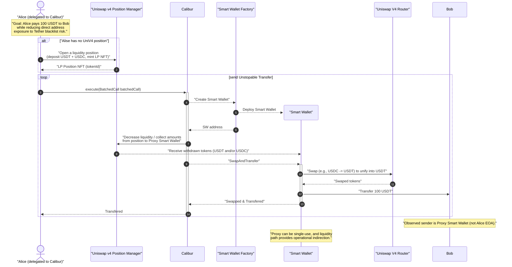

# Private Wallet - ETHGlobal Hackmoney2026
Backed with Uniswap V4 position
## Disclaimer  
!!!!! This is Demo Solution for educational purposes ONLY   !!!!!
 So you have to do your own research  before use in production despite it
 fully work. Please note the unlimited slippage and so on.  

## Key property of this design

Assets are not held at the user’s EOA.
Instead, funds are deposited into a **Uniswap v4 liquidity position** , where they continuously earn yield as a liquidity provider.

This custody model renders address-level freezes enforced by centralized stablecoin issuers ineffective, because no assets reside on the owner’s address that can be directly blacklisted or seized.

Fund transfers from this “wallet” are executed within a single atomic transaction using account abstraction, based on the **Uniswap Calibur** solution.

Within this transaction (which can be submitted by any relayer possessing a valid owner signature), the following steps occur atomically:

- A temporary, single-use proxy smart wallet is deployed  
- The required portion of liquidity is withdrawn from the Uniswap v4 position to the proxy wallet  
- The withdrawn assets are swapped on Uniswap into a single target asset
- The target asset is transferred to the recipient address

## Deploy Factory And ProxyWallet Implementation
```shell
$ # Deploy in BSC
$ forge script script/DeployFactoryAndWallet.s.sol:DeployFactoryAndWallet --rpc-url bnb_smart_chain  --account env_deploy_2025 --sender 0x13B9cBcB46aD79878af8c9faa835Bee19B977D3D --broadcast --verify --etherscan-api-key $ETHERSCAN_TOKEN

$ # Deploy in Unichain
$ forge script script/DeployFactoryAndWallet.s.sol:DeployFactoryAndWallet --rpc-url unichain  --account env_deploy_2025 --sender 0x13B9cBcB46aD79878af8c9faa835Bee19B977D3D --broadcast --verify --etherscan-api-key $ETHERSCAN_TOKEN 

$ # Run Script for Demo Unstopable transfers from Uniswap V4 position
$  forge script script/InteracteScript_m.s.sol:InteracteScript --rpc-url bnb_smart_chain  --broadcast --via-ir --account secret2
$  forge script script/InteracteScript_m.s.sol:InteracteScript --rpc-url unichain  --broadcast --via-ir --account secret2
```

## Deployment Info (2026-02-07)
#### BSC
**WalletFactory**  
https://bscscan.com/address/0xfcb6910d217AAc4B9d7a205473024964A08Bc8eC#code  

**ProxySmartWallet**  
https://bscscan.com/address/0xa5A1fF40a1F89F26Db124DC56ad6fD8aBb378f29#code

#### Unichain
**WalletFactory**  
https://uniscan.xyz/address/0xBDb5201565925AE934A5622F0E7091aFFceed5EB#code  

**ProxySmartWallet**  
https://uniscan.xyz/address/0x21c23bA0ec49c9440CD259cCB48ff9D06CD16522#code  

**Demo Tx Example**  
https://uniscan.xyz/tx/0x5e03a1bc8d142c57ec3df726ee64557c2ebb371ccc717d4389c62bce27e4db37 

 
## Main Concept

